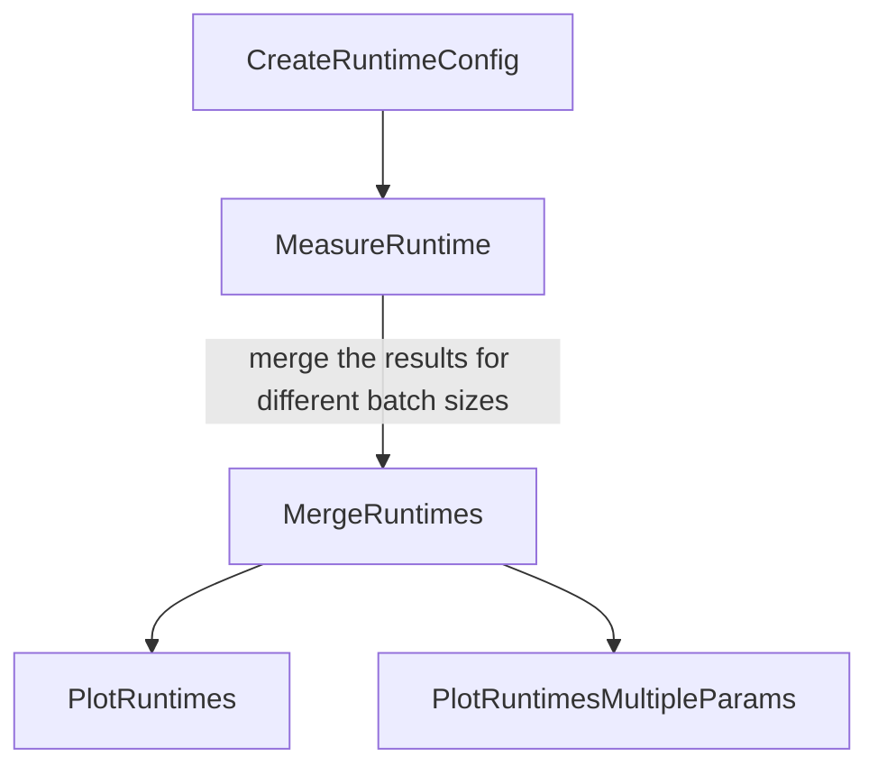

# MLProf

[](https://github.com/uhh-cms/MLProf/actions/workflows/lint.yml)

Tools for automated ML model performance tests in CMSSW (CMSSW version 13 and above).

## Quickstart

To setup this tool, start by cloning the repository on your lxplus node and install the required venv using the command:

```shell
source setup.sh
```

This command is also used to activate your venv at the start of each new bash session.

To check the setup and create a basic plot with this tool on an already existing graph, you may run the task [PlotRuntimes](#plotruntimes) with a simple call:

```shell
law run PlotRuntimes --version test_mlprof
```


## Law introduction

As you can already see from the Quickstart section, this tool uses [law](https://github.com/riga/law) for the orchestration.
Therefore, a short introduction to the most essential functions of law you should be aware of when using this tool are provided here.
More informations are available for example in the "[Examples](https://github.com/riga/law#examples)" section of this [Github repository](https://github.com/riga/law).
This section can be ignored if you are already familiar with law.

In [law](https://github.com/riga/law), tasks are defined and separated by purpose and may have dependencies to each other.
As an example, MLProf defines a task for the runtime measurement of a network for several batch sizes and a different task to make a plot of these data.
The plotting task requires the runtime measurement task to have already run, in order to have data to plot.
This is checked by the presence or absence of the corresponding output file from the required task.
If the required file is not present, the required task will be automatically started with the corresponding parameters before the called task.

The tree of runtime tasks in MLPROF is:



A task is run with the command `law run` followed by the name of the task.
A version, given by the argument `--version`, followed by the name of the version, is required.
Each `version` has its own set of outputs for the different existing tasks.

In law, the intermediate results (=the outputs to the different tasks) are saved locally in the corresponding directory (default path in MLPROF is ```data/name_of_the_task/CMSSW_architecture/model_identifier_with_run_parameters/name_of_the_version/```).
Hence the name of the version should be selected to match your purpose, for example `--version convolutional_nn_for_b_tagging`.

Tasks in law are organized as a graph with dependencies.
Therefore a "depth" for the different required tasks exists, depending on which task required which other task.
In order to see the different required tasks for a single task, you might use the argument `--print-status -1`, which will show all required tasks and the existence or absence of their output for the given input parameters up to depth "-1", hence the deepest one.
The called task with `law run` will have depth 0.
You might check the output path of a task with the argument `--print-output`, followed by the depth of the task.
If you want a finished task to be run anew without changing the version (e.g. do a new runtime measurement with a new training of the same original network), you might remove the previous outputs with the `--remove-output` argument, followed by the depth up to which to remove the outputs.
There are three removal modes:
- `a` (all: remove all outputs of the different tasks up to the given depth),
- `i` (interactive: prompt a selection of the tasks to remove up to the given depth)
- `d` (dry: show which files might be deleted with the same selection options, but do not remove the outputs).

The `--remove-output` argument does not allow the depth "-1", check the task tree with `--print-output` before selecting the depth you want.
The removal mode can be already selected in the command, e.g. with `--remove-output 1,a` (remove all outputs up to depth 1).

Once the output has been removed, it is possible to run the task again.
It is also possible to rerun the task in the same command as the removal by adding the `y` argument at the end.
Therefore, removing all outputs of a selected task (but not its dependencies) and running it again at once would correspond to the following command:

```shell
law run name_of_the_task --version name_of_the_version --remove-output 0,a,y
```

An example command to see the location of the plot from this tool using only law functions and the default arguments for the tasks would be:

```shell
law run PlotRuntimes --version test_mlprof --print-output 0
```


## Profiling

This tools uses the c++ `<chrono>` library for runtime measurements and (soon) [IgProf](https://igprof.org/) for the memory profiling.
It allows for the measurement of TensorFlow graphs (.pb) and ONNX models (.onnx) with several input layers.
As this tool is set to work in CMSSW, it requires a frozen graph for TensorFlow models (it is recommended to use the cmsml [save_graph](https://cmsml.readthedocs.io/en/latest/api/tensorflow.html#cmsml.tensorflow.save_graph) function with the argument "True" for variables_to_constant).


## Runtime measurement

The dependency graph for the runtime measurement looks as follows:


It is composed of four major types of tasks:

1. [CreateRuntimeConfig](#createruntimeconfig): This task creates the cmssw config file to run the inference, using a json file for the model parameters.

2. [MeasureRuntime](#measureruntime): This task runs the network as many times as demanded in the arguments for a single batch size and outputs a .csv file with the results of the timing measurements.

3. [MergeRuntimes](#mergeruntimes): This task merges the .csv output files with the required multiple batch sizes from the [MeasureRuntime](#measureruntime) tasks to obtain a single .csv file containing the informations to plot.

4. [PlotRuntimes](#plotruntimes), [PlotRuntimesMultipleParams](#plotruntimesmultipleparams): These tasks create the plots with the values stored in the .csv file from [MergeRuntimes](#mergeruntimes).

Calling the [PlotRuntimes](#plotruntimes) task triggers the whole pipeline with the correct arguments.

The way to give the necessary informations about your model to MLProf is by using a json file.
Its structure is presented below in [Model file in json format](#model-file-in-json-format).

# Model file in json format

The format of the file to give to MLProf is the following:

```json
{
    "file": "{path_to_your_pb_model_file}",
    "inputs": [
        {
            "name": "{name_input_layer_1}",
            "shape": [size_dimension_1, size_dimension_2, ...]
        },
        {
            "name": "{name_input_layer_2}",
            "shape": [size_dimension_1, size_dimension_2, ...]
        },
        ...
    ],
    "outputs": [
        {
            "name": "{name_of_the_output_layer_1}"
        },
        {
            "name": "{name_of_the_output_layer_2}"
        },
        ...
    ],
    "inference_engine": "{name_of_inference_engine_(either_tf_or_onnx)}",
    "network_name": "{optional_name_of_the_network_for_the_labels}"
}
```
There are already a few examples of these configs with working paths for the networks in the "examples" folder.

# CreateRuntimeConfig

This task create the CMSSW config file to run the inference in the corresponding task, using the template file in the `cmssw/MLProf/RuntimeModule/test/` directory.
The parameters of the inference except the batch sizes are fixed by the created configuration file, therefore this task will be run again for every change in the inference (e.g. the number of runs for the statistics, the path to the graph to check...).

## Parameters:

- model-file: str. The absolute path of the json file containing the informations of the model to be tested. default: `$MLP_BASE/examples/simple_dnn/model.json`.

- model-name: str. When set, use this name for the path used when storing outputs instead of a hashed version of `--model-file`. default: empty.

- model-label: str. When set, use this string for the model label in the plots from the plotting tasks. When empty, the `network_name` field in the model json data is used when existing, and model-name otherwise. default: empty.

- n-events: int. The number of events to read from each input file for averaging measurements. default: `1`.

- n-calls: int. The number of calls to be performed per evaluation for averaging. default: `100`.

- input-type: str. Define the kind of inputs used during the measurement, either 'random', 'incremental', 'zeros', or a path to a root file. default: random

- cmssw-version: str. The CMSSW version used for the inference. default: `CMSSW_13_3_1`.

- scram-arch: str. The SCRAM architecture used for the inference. default: `slc7_amd64_gcc12`.

## Output:

- `cfg.py`: The config file for the `RuntimeModule` in `cmssw/MLProf`.

## Example:

```shell
law run CreateRuntimeConfig \
    --version test_simple_dnn \
    --model-file "$MLP_BASE/examples/simple_dnn/model.json" \
    --model-name dnn \
    --n-calls 500 \
    --cmssw-version CMSSW_13_3_1
```


# MeasureRuntime

Task to provide the time measurements of the inference of a network in CMSSW, given the input parameters and a single batch size.
The batch size and the (```n-calls * n-events```) measured values in milliseconds are saved in csv format.

## Requires:

- The config file created by `CreateRuntimeConfig`.

## Parameters:

- batch-size: int. the batch size to measure the runtime for. default: `1`.

- model-file: str. The absolute path of the json file containing the informations of the model to be tested. default: `$MLP_BASE/examples/simple_dnn/model.json`.

- model-name: str. When set, use this name for the path used when storing outputs instead of a hashed version of `--model-file`. default: empty.

- model-label: str. When set, use this string for the model label in the plots from the plotting tasks. When empty, the `network_name` field in the model json data is used when existing, and model-name otherwise. default: empty.

- n-events: int. The number of events to read from each input file for averaging measurements. default: `1`.

- n-calls: int. The number of calls to be performed per evaluation for averaging. default: `100`.

- input-type: str. Define the kind of inputs used during the measurement, either 'random', 'incremental', 'zeros', or a path to a root file. default: random

- cmssw-version: str. The CMSSW version used for the inference. default: `CMSSW_13_3_1`.

- scram-arch: str. The SCRAM architecture used for the inference. default: `slc7_amd64_gcc12`.

## Output:
- `runtime_bs_{batch-size}.csv`: The batch size and measured values of the runtime
for each repetition and event.

## Example:

```shell
law run MeasureRuntime --version test_simple_dnn \
                       --model-file $MLP_BASE/examples/simple_dnn/model.json \
                       --model-name dnn \
                       --n-calls 500 \
                       --cmssw-version CMSSW_13_3_1 \
                       --batch-size 1
```


# MergeRuntimes

This task merges the .csv output files with the required multiple batch sizes from the different occurences of the `MeasureRuntime` task to obtain a single .csv file containing the informations to plot.

## Requires:
- The .csv files from the several occurences of `MeasureRuntime` (one for each batch size).

## Parameters:
- batch-sizes: int. The comma-separated list of batch sizes to be tested; default: `1,2,4`.

- model-file: str. The absolute path of the json file containing the informations of the model to be tested. default: `$MLP_BASE/examples/simple_dnn/model.json`.

- model-name: str. When set, use this name for the path used when storing outputs instead of a hashed version of `--model-file`. default: empty.

- model-label: str. When set, use this string for the model label in the plots from the plotting tasks. When empty, the `network_name` field in the model json data is used when existing, and model-name otherwise. default: empty.

- n-events: int. The number of events to read from each input file for averaging measurements. default: `1`.

- n-calls: int. The number of calls to be performed per evaluation for averaging. default: `100`.

- input-type: str. Define the kind of inputs used during the measurement, either 'random', 'incremental', 'zeros', or a path to a root file. default: random

- cmssw-version: str. The CMSSW version used for the inference. default: `CMSSW_13_3_1`

- scram-arch: str. The SCRAM architecture used for the inference. default: `slc7_amd64_gcc12`

## Output:
- `runtime_bs_{batch_size_1}_{batch_size_2}_{...}.csv`: The batch size and measured values of the runtime for each repetition and event in the several measurements.

## Example:

```shell
law run MergeRuntimes --version test_simple_dnn \
                      --model-file $MLP_BASE/examples/simple_dnn/model.json \
                      --model-name dnn \
                      --n-calls 500 \
                      --cmssw-version CMSSW_13_3_1 \
                      --batch-sizes 1,2,4,8,16,32,64,128,256,512,1024
```

# PlotRuntimes

This task plots the results of the runtime measurement against the given batch sizes.
The points are given by the median of the data series and the boundaries of the uncertainty bands are given by the 16 and 84 percentiles of the data series (Therefore the uncertainty band contains 68% of the data points, which corresponds to a $1\sigma$ uncertainty for gaussian uncertainties).
The number of inferences behind one plotted data point is given by `n-events * n-calls`.

## Requires:
- The .csv file from the `MergeRuntimes` task.

## Parameters:
- log-y: bool. Plot the y-axis values logarithmically; default: `False`.

- bs-normalized: bool. Normalize the measured values with the batch size before plotting; default: `True`.

- filling: bool. Plot the errors as error bands instead of error bars; default: `True`.

- top-right-label: str. When set, stick this string as label over the top right corner of the plot. default: empty.

- batch-sizes: int. The comma-separated list of batch sizes to be tested; default: `1,2,4`.

- model-file: str. The absolute path of the json file containing the informations of the model to be tested. default: `$MLP_BASE/examples/simple_dnn/model.json`.

- model-name: str. When set, use this name for the path used when storing outputs instead of a hashed version of `--model-file`. default: empty.

- model-label: str. When set, use this string for the model label in the plots from the plotting tasks. When empty, the `network_name` field in the model json data is used when existing, and model-name otherwise. default: empty.

- n-events: int. The number of events to read from each input file for averaging measurements. default: `1`.

- n-calls: int. The number of calls to be performed per evaluation for averaging. default: `100`.

- input-type: str. Define the kind of inputs used during the measurement, either 'random', 'incremental', 'zeros', or a path to a root file. default: random

- cmssw-version: str. The CMSSW version used for the inference. default: `CMSSW_13_3_1`

- scram-arch: str. The SCRAM architecture used for the inference. default: `slc7_amd64_gcc12`

- file_types: str. Comma-separated types of the output plot files. default: "pdf".

- plot_postfix: str. An arbitrary postfix that is added with two underscores to all paths of produced plots. default: empty.

- view_cmd: str. A command to execute after the task has run to visualize plots right in the terminal (e.g. "imgcat" if installed). default: empty.


## Output:
- `runtime_plot_different_batch_sizes_{batch_size_1}_{batch_size_2}_{...}.pdf`: The plot of the runtime measurement against the different batch sizes given.

## Example:

```shell
law run PlotRuntimes --version test_simple_dnn \
                     --model-file $MLP_BASE/examples/simple_dnn/model.json \
                     --model-name dnn \
                     --model-label "dnn with CMSSW_13_3_1" \
                     --n-calls 500 \
                     --cmssw-version CMSSW_13_3_1 \
                     --batch-sizes 1,2,4,8,16,32,64,128,256,512,1024 \
                     --log-y False \
                     --bs-normalized True
```

# PlotRuntimesMultipleParams

This task plots the results of the runtime measurement against the given batch sizes for several values of the given parameters.
The model-files argument is required and replaces the module-file argument.
The cmssw-versions argument replaces the cmssw-version arguments, but both have the same default.
The scram-archs argument replaces the scram-arch argument, but both have the same default.
These arguments accept brace expansions, see below in the Example subsection.
The model-names and model-labels arguments replace repectively the model-name and model-label arguments and are empty by default.
The points are given by the median of the data series and the boundaries of the uncertainty bands are given by the 16 and 84 percentiles of the data series (Therefore the uncertainty band contains 68% of the data points, which corresponds to a $1\sigma$ uncertainty for gaussian uncertainties).
The number of inferences behind one plotted data point is given by `n-events * n-calls`.

## Requires:
- The .csv files from the `MergeRuntimes` task.

## Parameters:
- model-files: str. The comma-separated list of the absolute paths of the json files containing the informations of the model to be tested. No default value.

- cmssw-versions: str. The comma-separated list of CMSSW versions used for the inference. default: `CMSSW_13_3_1`

- scram-archs: str. The comma-separated list of SCRAM architectures used for the inference. default: `slc7_amd64_gcc12`

- model-names: str. The comma-separated list of model names. When set, use these names for the path used when storing outputs instead of a hashed version of `--model-file`. default: empty.

- model-labels: str. The comma-separated list of model labels. When set, use these strings for the model labels in the plots from the plotting tasks. When empty, the `network_name` fields in the models json data is used when existing, and model-names otherwise. default: empty.

- log-y: bool. Plot the y-axis values logarithmically; default: `False`.

- bs-normalized: bool. Normalize the measured values with the batch size before plotting; default: `True`.

- top-right-label: str. When set, stick this string as label over the top right corner of the plot. default: empty.

- filling: bool. Plot the errors as error bands instead of error bars; default: `True`.

- batch-sizes: int. The comma-separated list of batch sizes to be tested; default: `1,2,4`.

- n-events: int. The number of events to read from each input file for averaging measurements. default: `1`

- n-calls: int. The number of calls to be performed per evaluation for averaging. default: `100`

- input-type: str. Define the kind of inputs used during the measurement, either 'random', 'incremental', 'zeros', or a path to a root file. default: random.

- file_types: str. Comma-separated types of the output plot files. default: "pdf".

- plot_postfix: str. An arbitrary postfix that is added with two underscores to all paths of produced plots. default: empty.

- view_cmd: str. A command to execute after the task has run to visualize plots right in the terminal (e.g. "imgcat" if installed). default: empty.

## Output:
- `runtime_plot_networks_{param_1}_{param_2}_{...}_different_batch_sizes_{batch_size_1}_{batch_size_2}_{...}.pdf`: The plot of the runtime measurements against the different batch sizes given.

## Example:

```shell
law run PlotRuntimesMultipleParams --version test_several_networks \
                                   --model-files $MLP_BASE/examples/simple_dnn/model.json,$MLP_BASE/examples/simple_dnn/model_onnx.json\
                                   --model-names "dnn","dnn_onnx"\
                                   --model-labels "dnn","dnn onnx"\
                                   --cmssw-versions CMSSW_13_3_1,CMSSW_13_2_4 \
                                   --n-calls 500 \
                                   --batch-sizes 1,2,4,8,16,32,64,128,256,512,1024 \
                                   --log-y False \
                                   --bs-normalized True \
                                   --top-right-label "$\sqrt{s}=13.6$ TeV"
```

equivalent to the brace expanded version:

```shell
law run PlotRuntimesMultipleParams --version test_several_networks \
                                   --model-files "$MLP_BASE/examples/{simple_dnn/model,simple_dnn/model_onnx}.json"\
                                   --model-names "dnn","dnn_onnx"\
                                   --model-labels "dnn","dnn onnx"\
                                   --cmssw-versions "CMSSW_13_{3_1,2_4}" \
                                   --n-calls 500 \
                                   --batch-sizes 1,2,4,8,16,32,64,128,256,512,1024 \
                                   --log-y False \
                                   --bs-normalized True \
                                   --top-right-label "$\sqrt{s}=13.6$ TeV"
```
