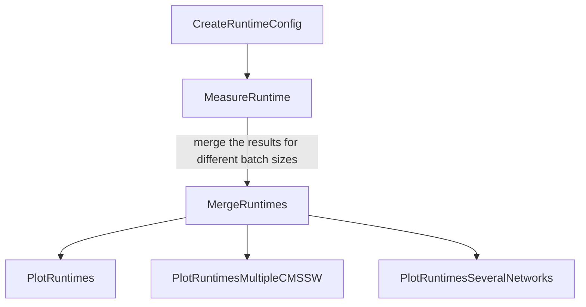

# MLProf

Tools for automated ML model performance tests in CMSSW

## Quickstart

To setup this tool, start by cloning the repository on your lxplus node and install the required venv using the command:

```shell
source setup.sh
```

This command is also used to activate your venv at the start of each new bash session.

To check the setup and create a basic plot with this tool on an already existing graph, you may run the task [PlotRuntimes](#plotruntimes)
with a simple call:

``` shell
law run PlotRuntimes --version test_mlprof
```


## Law introduction

As you can already see from the Quickstart section, this tool uses [law](https://github.com/riga/law) for
the orchestration. Therefore, a short introduction to the most essential functions of law you should be
aware of when using this tool are provided here. More informations are available for example in the "[Examples](https://github.com/riga/law#examples)"
section of this [Github repository](https://github.com/riga/law).
This section can be ignored if you are already familiar with law.

In [law](https://github.com/riga/law), tasks are defined and separated by purpose and may have dependencies to each other.
As an example, MLProf defines a task for the runtime measurement of a network for
several batch sizes and a different task to make a plot of these data. The plotting task requires the
runtime measurement task to have already run, in order to have data to plot. This is checked
by the presence or absence of the corresponding output file from the required task. If the required file is not present,
the required task will be automatically started with the corresponding parameters before the called task.

The tree of runtime tasks in MLPROF is :



A task is run with the command ```law run``` followed by the name of the task.
A version, given by the argument ```--version```, followed by the name of the version, is required.
Each ```version``` has its own set of outputs for the different existing tasks.

In law, the intermediate results (=the outputs to the different tasks) are saved locally in the corresponding directory
(default path in MLPROF is
```data/name_of_the_task/CMSSW_architecture/model_identifier_with_run_parameters/name_of_the_version/```).
Hence the name of the version should be selected to match your
purpose, for example ```--version convolutional_nn_for_b_tagging```.

Tasks in law are organized as a graph with dependencies. Therefore a "depth" for the different required tasks exists,
depending on which task required which other task. In order to see the different required tasks for a single task,
you might use the argument ```--print-status -1```, which will show all required tasks and the existence or absence
of their output for the given input parameters up to depth "-1", hence the deepest one. The called task
with ```law run``` will have depth 0. You might check the output path of a task with the
argument ```--print-output```, followed by the depth of the task. If you want a finished task to be run anew without changing
the version (e.g. do a new runtime measurement with a new
training of the same original network), you might remove the previous outputs with the
```--remove-output``` argument, followed by the depth up to which to remove the outputs. There are three removal modes:
- ```a``` (all: remove all outputs of the different tasks up to the given depth),
- ```i``` (interactive: prompt a selection of the tasks to remove up to the given depth)
- ```d``` (dry: show which files might be deleted with the same selection options, but do not remove the outputs).

The ```--remove-output``` argument does not allow the depth "-1", check the task
tree with ```--print-output``` before selecting the depth you want. The removal mode
can be already selected in the command, e.g. with ```--remove-output 1,a``` (remove all outputs up to depth 1).

Once the output has been removed, it is possible to run the task again. It is also possible to rerun the task
in the same command as the removal by adding the ```y``` argument at the end. Therefore, removing all outputs
of a selected task (but not its dependencies) and running it again at once would correspond to the following command:

```shell
law run name_of_the_task --version name_of_the_version --remove-output 0,a,y
```

An example command to see the location of the plot from this tool using only law functions and the default arguments for the tasks would be:

```shell
law run PlotRuntimes --version test_mlprof --print-output 0
```


## Profiling

This tools uses the c++ ```<chrono>``` library for runtime measurements and (soon) [IgProf](https://igprof.org/) for the memory profiling.
It allows for the measurement of TensorFlow graphs with several input layers. The inputs can be up to 3 dimensional. As this tool is set
to work in CMSSW, it requires a frozen graph (it is recommended to use the cmsml [save_graph](https://cmsml.readthedocs.io/en/latest/api/tensorflow.html#cmsml.tensorflow.save_graph)
function with the argument "True" for variables_to_constant).


## Runtime measurement

The dependency graph for the runtime measurement looks as follows:


It is composed of four major types of tasks:

1.[CreateRuntimeConfig](#createruntimeconfig): This task creates the cmssw config file to run the inference, using a
json file for the model parameters.

2. ```MeasureRuntime```: This task runs the network as many times as demanded in the arguments for a
single batch size and outputs a .csv file with the results of the timing measurements.

3. ```MergeRuntimes```: This task merges the .csv output files with the required multiple batch sizes
from the ```MeasureRuntime``` tasks to obtain a single .csv file containing the informations to plot.

4. ```PlotRuntimes```: These tasks create the plots with the values stored in the .csv file from ```MergeRuntimes```.

Calling the ```PlotRuntimes``` task triggers the whole pipeline with the correct arguments.


# CreateRuntimeConfig

This task create the CMSSW config file to run the inference in the corresponding task, using the template file in
the ```MLProf/utils``` directory. The parameters of the inference except the batch sizes are fixed by the created
configuration file, therefore this task should be run again for every change in the inference.
(e.g. the number of runs for the statistics, the path to the graph to check...).

## Parameters:
- graph-path: str.  The path of the .pb graph to be tested. default: ```/afs/cern.ch/user/n/nprouvos/public/graph.pb```

- input-files: str. The absolute path of the input files in root format to be openened in CMSSW, needed for
                    cmsRun and the ```number-events```argument but might NOT be used for the input values,
                    depending on the input type argument.
                    default: ```/afs/cern.ch/user/n/nprouvos/public/testfile.root```

- number-events: int. The number of events to take from the input files for the inference. default: ```10```

- output-directory: str. The path to the folder to save the csv files with the results for the inference tasks,
                        standard law path will be used if value is law.NO_STR. default: ```law.NO_STR```

- input-type: str, either "random" or "incremental". Type of input values to be used, for testing the network,
                    either random or incremental ("custom" preprocessing taking the events from the input files
                    to be implemented). default: ```random```

- number-runs: int. The number of batches to be evaluated and measurement averaged upon for each event. default: ```500```

- number-warm_ups: int. The number of batches to be evaluated to warm up the hardware before the actual measurement.
                    default: ```50```

- input-shapes: str. The name of the input layers followed by their shapes, separated by a comma.
                The format is ```'name_input_tensor1:first_dimension_shape-second_dim_shape,name_input_tensor2:...'```
                Therefore, the name of the layer may not contain ':'. default: ```'input:10'```.

- output-tensor-names: str. The name of the output nodes, separated by a comma.
                    The format is ```'name_output_tensor1,name_output_tensor2...'```. default is ```'Identity'```


## Output:
- ```MLProf/RuntimeModule/test/my_plugin_runtime_cfg.py```: the config file for the ```RuntimeModule``` in MLProf.

## Example:

```shell
law run CreateRuntimeConfig --version simple_dnn \
                            --graph-path /afs/cern.ch/user/n/nprouvos/public/simple_dnn.pb \
                            --input-shapes input_0:784 \
                            --output-tensor-name Identity \
                            --number-runs 500
```


# MeasureRuntime

Task to provide the time measurements of the inference of a network in CMSSW, given the input parameters
and a single batch size. The statistics of the measurement (batch size, mean, standard deviation) for each
event taken from ```input-files``` are saved in csv format. Default number of events taken is 10.

## Requires:
- The config file created by ```CreateRuntimeConfig```.

## Parameters:
- batch-size: int. The size of the batch for which the runtime measurement is done. default: ```1```

- graph-path: str.  The path of the .pb graph to be tested. default: ```/afs/cern.ch/user/n/nprouvos/public/graph.pb```

- input-files: str. The absolute path of the input files in root format to be openened in CMSSW, needed for
                    cmsRun and the ```number-events```argument but might NOT be used for the input values,
                    depending on the input type argument.
                    default: ```/afs/cern.ch/user/n/nprouvos/public/testfile.root```

- number-events: int. The number of events to take from the input files for the inference. default: ```10```

- output-directory: str. The path to the folder to save the csv files with the results for the inference tasks,
                        standard law path will be used if value is law.NO_STR. default: ```law.NO_STR```

- input-type: str, either "random" or "incremental". Type of input values to be used, for testing the network,
                    either random or incremental ("custom" preprocessing taking the events from the input files
                    to be implemented). default: ```random```

- number-runs: int. The number of batches to be evaluated and measurement averaged upon for each event. default: ```500```

- number-warm_ups: int. The number of batches to be evaluated to warm up the hardware before the actual measurement.
                    default: ```50```

- input-shapes: str. The name of the input layers followed by their shapes, separated by a comma.
                The format is ```'name_input_tensor1:first_dimension_shape-second_dim_shape,name_input_tensor2:...'```
                Therefore, the name of the layer may not contain ':'. default: ```'input:10'```.

- output-tensor-names: str. The name of the output nodes, separated by a comma.
                    The format is ```'name_output_tensor1,name_output_tensor2...'```. default is ```'Identity'```

## Output:
- ```results_batch_size_{batch-size}.csv```: The statistics (batch size, mean, standard deviation)
of the runtime measurement for each "event" (set by ```number-events```) taken from the ```input-files```.

## Example:

```shell
law run MeasureRuntime --version simple_dnn \
                                       --graph-path /afs/cern.ch/user/n/nprouvos/public/simple_dnn.pb \
                                       --input-shapes input_0:784 \
                                       --output-tensor-name Identity \
                                       --number-runs 500 \
                                       --batch-size 1
```


# MergeRuntimes

This task merges the .csv output files with the required multiple batch sizes
from the different occurences of the ```MeasureRuntime``` task to obtain a single .csv
file containing the informations to plot.

## Requires:
- The .csv files from the several occurence of ```MeasureRuntime``` (one for each batch size).

## Parameters:
- batch-sizes: int. The different batchsizes to be tested, separated by a comma.
            The format is ```batch_size1,batch_size2...```. default: ```1,2,4```.

- graph-path: str.  The path of the .pb graph to be tested. default: ```/afs/cern.ch/user/n/nprouvos/public/graph.pb```

- input-files: str. The absolute path of the input files in root format to be openened in CMSSW, needed for
                    cmsRun and the ```number-events```argument but might NOT be used for the input values,
                    depending on the input type argument.
                    default: ```/afs/cern.ch/user/n/nprouvos/public/testfile.root```

- number-events: int. The number of events to take from the input files for the inference. default: ```10```

- output-directory: str. The path to the folder to save the csv files with the results for the inference tasks,
                        standard law path will be used if value is law.NO_STR. default: ```law.NO_STR```

- input-type: str, either "random" or "incremental". Type of input values to be used, for testing the network,
                    either random or incremental ("custom" preprocessing taking the events from the input files
                    to be implemented). default: ```random```

- number-runs: int. The number of batches to be evaluated and measurement averaged upon for each event. default: ```500```

- number-warm_ups: int. The number of batches to be evaluated to warm up the hardware before the actual measurement.
                    default: ```50```

- input-shapes: str. The name of the input layers followed by their shapes, separated by a comma.
                The format is ```'name_input_tensor1:first_dimension_shape-second_dim_shape,name_input_tensor2:...'```
                Therefore, the name of the layer may not contain ':'. default: ```'input:10'```.

- output-tensor-names: str. The name of the output nodes, separated by a comma.
                    The format is ```'name_output_tensor1,name_output_tensor2...'```. default is ```'Identity'```

## Output:
- ```results_batchsizes_{batch_size_1}_{batch_size_2}_{...}.csv```: The statistics (batch size, mean, standard deviation)
of the several runtime measurements for each "event" (set by ```number-events```) taken from the ```input-files```.

## Example:

```shell
law run MergeRuntimes --version simple_dnn \
                           --graph-path /afs/cern.ch/user/n/nprouvos/public/simple_dnn.pb \
                           --input-shapes input_0:784 \
                           --output-tensor-name Identity \
                           --number-runs 500 \
                           --batch-sizes 1,2,4,8,16,32,64,128,256,512,1024
```

# PlotRuntimes

This task plots the results of the runtime measurement against the given batch sizes. The number of inferences behind one
plotted data point is given by ```number-events * number-runs```.

## Requires:
- The .csv file from the ```MergeRuntimes``` task.

## Parameters:
- batch-sizes: int. The different batchsizes to be tested, separated by a comma.
            The format is ```batch_size1,batch_size2...```. default: ```1,2,4```.

- output_directory_plot: str. The path to the folder to save the pdf file with the plot,
                standard law path will be used if value is ```law.NO_STR```.
                default: ```law.NO_STR```

- graph-path: str.  The path of the .pb graph to be tested. default: ```/afs/cern.ch/user/n/nprouvos/public/graph.pb```

- input-files: str. The absolute path of the input files in root format to be openened in CMSSW, needed for
                    cmsRun and the ```number-events```argument but might NOT be used for the input values,
                    depending on the input type argument.
                    default: ```/afs/cern.ch/user/n/nprouvos/public/testfile.root```

- number-events: int. The number of events to take from the input files for the inference. default: ```10```

- output-directory: str. The path to the folder to save the csv files with the results for the inference tasks,
                        standard law path will be used if value is law.NO_STR. default: ```law.NO_STR```

- input-type: str, either "random" or "incremental". Type of input values to be used, for testing the network,
                    either random or incremental ("custom" preprocessing taking the events from the input files
                    to be implemented). default: ```random```

- number-runs: int. The number of batches to be evaluated and measurement averaged upon for each event. default: ```500```

- number-warm_ups: int. The number of batches to be evaluated to warm up the hardware before the actual measurement.
                    default: ```50```

- input-shapes: str. The name of the input layers followed by their shapes, separated by a comma.
                The format is ```'name_input_tensor1:first_dimension_shape-second_dim_shape,name_input_tensor2:...'```
                Therefore, the name of the layer may not contain ':'. default: ```'input:10'```.

- output-tensor-names: str. The name of the output nodes, separated by a comma.
                    The format is ```'name_output_tensor1,name_output_tensor2...'```. default is ```'Identity'```

## Output:
- ```runtime_plot_different_batchsizes_{batch_size_1}_{batch_size_2}_{...}.pdf```: The plot of the runtime measurement
against the different batch sizes given.

## Example:

```shell
law run PlotRuntimes --version simple_dnn \
                           --graph-path /afs/cern.ch/user/n/nprouvos/public/simple_dnn.pb \
                           --input-shapes input_0:784 \
                           --output-tensor-name Identity \
                           --number-runs 500 \
                           --batch-sizes 1,2,4,8,16,32,64,128,256,512,1024
```

